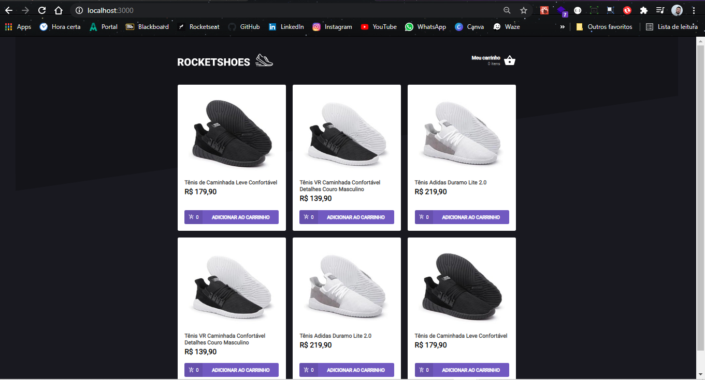

# <h1 align="center">Ignite Challenge (Trail ReactJS - Chapter II)</h1>

<h2 align="center">Challenge 02 - Creating a shopping cart hook (Rocketseat)</h2>

## 📑 Sobre o Desafio

Nesse desafio, foi criado uma aplicação para colocar em prática alguns conceitos do ReactJS.
  Essa será uma aplicação onde o seu principal objetivo é criar um hook para gerenciar um carrinho de compras. Acesso a duas páginas, um componente e um hook para implementar as funcionalidades. :octocat:

  

É uma aplicação de gerenciamento de carrinho de compras, onde foi colocado em prática os conceitos para:

* 1º: Adicionar um novo produto ao carrinho ✔
* 2º: Remover um produto do carrinho ✔
* 3º: Alterar a quantidade de um produto no carrinho ✔
* 4º: Calcular os preços sub-total e total do carrinho ✔
* 5º: Validação de estoque ✔
* 6º: Exibição de mensagens de erro ✔
* Entre outros...

 

<h2 align="center">RocketShoes</h2>

  <kbd></kbd>

 

  <kbd></kbd>

 

<h3 align="center">#Turma_01 - Front-end Developer N/A0110629</h3>

  <kbd></kbd>

  <kbd></kbd>

#

<h3 align="center">Licença</h3>
<h6 align="center">Esse projeto está sob a licença MIT. Veja o arquivo LICENSE para mais detalhes.</h6>

  
  

---

  
    

